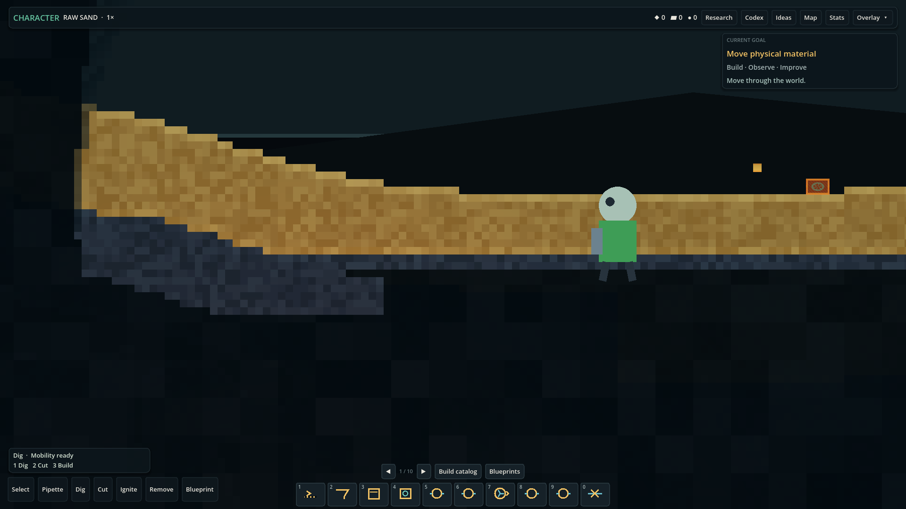
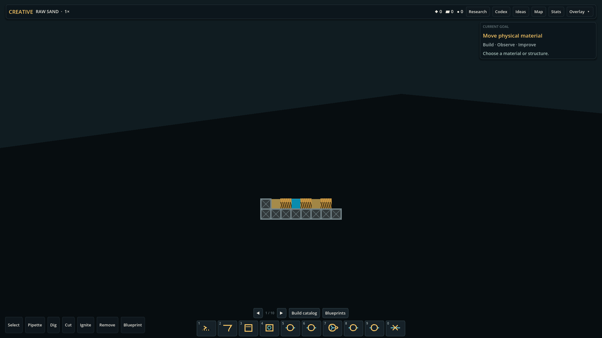

# KoalaSand

A physics-first falling-sand factory game where materials flow, separate, heat, burn, boil, leak and power machinery in one deterministic world.



## What is KoalaSand?

KoalaSand combines a side-view cellular sandbox with factory construction. Raw Sand carries deterministic geological composition. Water, gases, temperature, combustion, pipes, structures, power and automation operate on the same authoritative simulation instead of exchanging abstract inventory recipes.

### Physicality first

There is no black-box Furnace recipe. Players arrange ordinary components—Mesh, Vibration Actuator, Riffles, Water, magnetic fields, heat, oxygen, vessels and pipes—and the process emerges from their physical interaction. Clogs, spills, pressure damage, leaks, cooling and blocked exhaust remain visible consequences.



## Game modes

- **Factory** — world-scale construction and production management.
- **Character** — local movement, digging, building, Jetpack and limited live vision.
- **Creative** — unrestricted sandbox tools over the same simulation rules.

## Current features

- Deterministic chunked granular, liquid, gas and thermal simulation.
- Procedural finite geology, caves, Water, Coal and organic life.
- Exact six-constituent material accounting with persistent fractional carry.
- Physical screening, wet separation, magnetic capture, heating, melting, casting, combustion, charcoal and cooking.
- Conveyors, finite subsurface routes, spatial pipes with local failures, Steam turbines, shafts and electrical networks.
- Sensors, integer logic, automation, Blueprints, overlays and physical inspection.
- Main Menu, New/Continue/Load, atomic saves, backups, autosave and recovery.
- Shared Research, milestones, onboarding, Codex, Map and diagnostics.
- Bounded procedural audio and batched 2D presentation.

Example loop:

`Raw Sand → Screen + vibration → Water + Riffles → concentrates → magnetic/thermal separation → Silica, Iron, Gold and trace residues`

## Status

Current build: **0.1.0-playtest.2**. Early owner playtest; not a finished public release. Phase 13.7 establishes the audited source-control baseline without beginning Phase 14.

See [STATUS.md](STATUS.md), [MVP_SCOPE.md](MVP_SCOPE.md), [KNOWN_ISSUES.md](KNOWN_ISSUES.md) and [ROADMAP.md](ROADMAP.md).

## Performance

Representative targets are at least 100 FPS for normal Character, Factory, Creative and realistic maximum-factory scenarios on the validated Windows desktop. The intentionally pathological dense synthetic Megafactory is reported separately and may remain below that target.

| Gate | Target |
|---|---:|
| Authoritative simulation | fixed 30/60 Hz by subsystem contract |
| Character / Factory / Creative | ≥100 FPS |
| Realistic Max Factory | ≥100 FPS |
| Exact material torture | zero constituent drift |

Current measurements and hardware context: [PERFORMANCE.md](PERFORMANCE.md).

## Technology

- Godot `4.7.1.stable.official.a13da4feb`, GL Compatibility renderer.
- C++20 GDExtension built against pinned `godot-cpp` commit `5ed72a0dc2517a8082598a950895c6b24e8aa282`.
- GDScript for composition, UI, tooling and test orchestration.
- Deterministic integer/fixed-point authoritative state and data-oriented native hot paths.

## Build and run

Prerequisites: Windows PowerShell, Godot 4.7.1, CMake and a MinGW C++20 toolchain. Place the exact Godot executable in the sibling `Godot` directory, on `PATH`, or set `KOALASAND_GODOT` to its full path.

```powershell
.\scripts\build_native.ps1 -Clean
.\scripts\godot.ps1 --path .
```

Always launch Godot through `scripts/godot.ps1`. It verifies 4.7.1 and isolates editor/runtime profile state under ignored repository-local directories.

## Testing and benchmarks

```powershell
.\scripts\test.ps1
.\scripts\benchmark.ps1
.\scripts\benchmark.ps1 -IncludeRuntime
```

Native `ctest` is also meaningful and runs automatically after `scripts/build_native.ps1`.

## Package

With the Godot `4.7.1.stable` Windows export templates installed:

```powershell
.\scripts\package_playtest.ps1
```

The ignored package is produced under `artifacts/playtest/` with an exact source manifest and redistributed license files.

## Documentation

Start at [docs/INDEX.md](docs/INDEX.md). Architecture, simulation, persistence, performance, current design and clearly labeled historical phase records are indexed there.

## Diagnostics and privacy

KoalaSand has no telemetry. Saves, logs, screenshots and diagnostic exports remain local. The F3 diagnostics path is explicit and player-controlled.

## License

KoalaSand source and original assets are copyright-protected; no license grant is made by this repository. See [LICENSE](LICENSE). Godot Engine and `godot-cpp` are MIT-licensed; notices and full license texts are included in [THIRD_PARTY_NOTICES.txt](THIRD_PARTY_NOTICES.txt) and [licenses/](licenses/).
